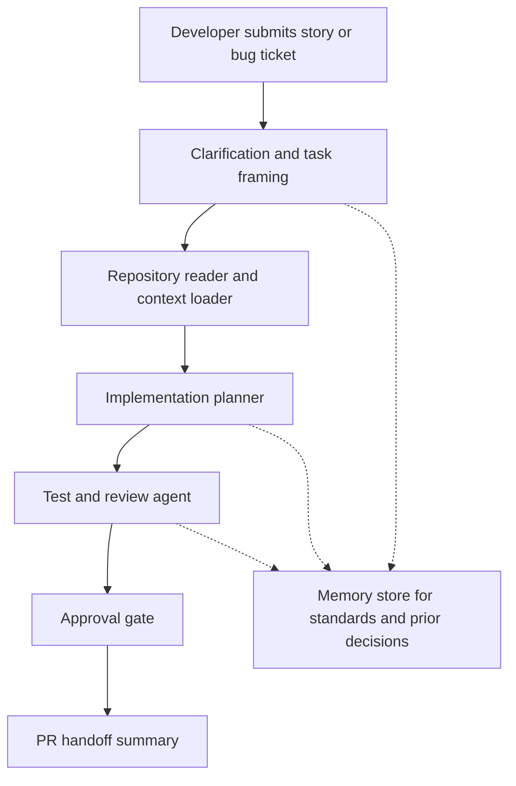

# Architecture Diagram

## Components
- Developer input: stories, acceptance criteria, logs, or tickets.
- Repository reader: inspects the sandbox app structure and relevant files.
- Planner: breaks the request into implementation, testing, and review work.
- Review agent: highlights risks around readability, security, maintainability, and testing.
- Approval gate: ensures a human confirms major changes before implementation.
