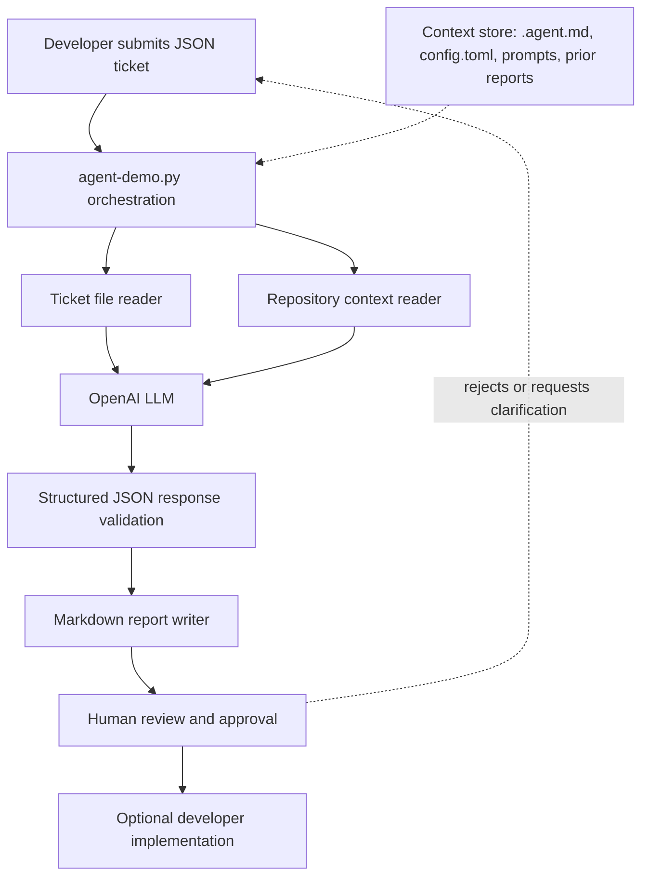

# Architecture Diagram

This diagram describes the implemented story-to-PR readiness workflow. The LLM is used for analysis; the local Python program orchestrates tools and controls output.

## Components
- LLM: OpenAI model selected through `OPENAI_MODEL`.
- Orchestrator: [agent-demo.py](../agent-demo.py) controls the workflow and never applies code changes.
- Ticket reader: loads a JSON object or list from the [tickets](../tickets) folder.
- Repository reader: reads the sandbox server, routes, controller, and reset view.
- Context store: [`.agent.md`](../.agent.md), [config.toml](../config.toml), prompt rules, and prior reports provide reusable guidance.
- Response validator: requires structured fields before a report is written.
- Report writer: stores output under [markdown_docs](../markdown_docs).
- Approval gate: a developer reviews recommendations before implementation or merge.

## Data and safety boundaries
- The API key is read from `OPENAI_API_KEY` and is not included in the prompt or report.
- Only the ticket intake fields and selected sandbox files are sent to the model in AI mode.
- The model is instructed not to edit files, execute commands, merge, deploy, or approve changes.
