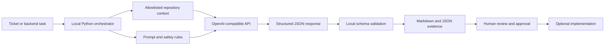
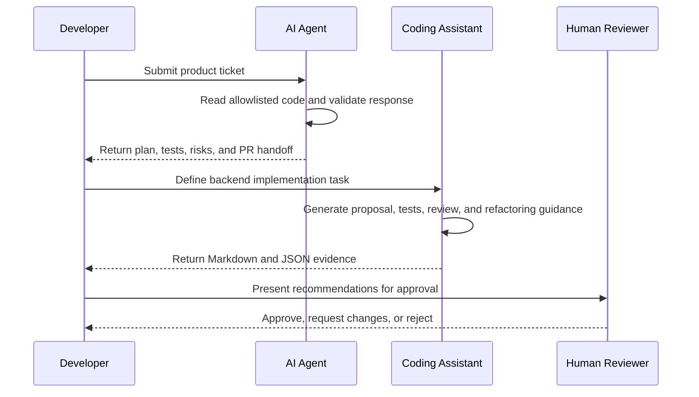

# Submission Upload Note

## Overview

This submission presents a Proof of Concept (PoC), meaning a small working demonstration, showing how artificial intelligence can support software development in two connected use cases. Both use cases use the same anonymized Express password-reset application as a safe sample repository.

The attached documents, source files, and Use Case 1 video are the primary submission evidence. The YouTube links and GitHub repository are optional backup access points in case a reviewer has difficulty opening an attachment. The written submission is intended to be understandable without opening an external link.

## Technical Architecture

The PoC has four layers:

1. **Input layer:** a ticket JSON file for Use Case 1 or a defined task dictionary for Use Case 2.
2. **Context layer:** each Python program reads only four allowlisted Express files: the server, routes, controller, and reset-form view.
3. **AI and validation layer:** live mode sends a JSON request to the OpenAI-compatible Chat Completions endpoint. The local program parses the response and checks that the expected fields are present before writing evidence.
4. **Evidence layer:** the validated result is written as human-readable Markdown and, for Use Case 2, a structured JSON result. A learner reviews the result before any implementation decision.

The model receives selected text only. It does not receive the API key, the entire workspace, or permission to execute commands or modify files. The Express application is separate from this analysis pipeline and is used only as the sample repository and optional local browser demo.

## Technical Scope and Limitations

The implemented PoC demonstrates local orchestration, controlled repository reading, prompt construction, live API communication, structured-response validation, Markdown/JSON evidence generation, and a human approval boundary. It does not demonstrate an autonomous software agent with permission to change or release code.

The following limitations are intentional and must be understood when reviewing the evidence:

- The Express application is an anonymized sample. It has no real database, password-hashing service, token store, authentication provider, or production error middleware.
- The password-reset controller is illustrative. The generated validation proposal does not by itself prove secure token validation, password persistence, or complete authentication security.
- The repository has no configured unit-test or integration-test runner. Test cases in the reports are proposals and have not been presented as executed test results.
- The local repository reader uses an explicit four-file allowlist. It does not discover every dependency, run the application, run tests, or inspect a production repository.
- Deterministic mode proves local report generation only. Live mode proves that the configured API returned a structured response, not that every recommendation is correct.
- The PoC does not measure production time savings, model cost at scale, response quality across a large ticket set, or deployment readiness.

These limitations are part of the review evidence: both use cases are designed to produce recommendations for a developer, who must confirm requirements, implement approved changes, and run appropriate tests.

## Use Case 1: AI Agent for Story-to-PR Readiness

Use Case 1 begins with a product ticket requesting a clearer confirmation page after a successful password reset. The local Python program `agent-demo.py` reads the ticket, adds context from selected sample repository files, and sends that controlled context to an OpenAI-compatible language-model endpoint when live mode is enabled.

The program validates the structured response and writes a Markdown report. The report contains clarification questions, assumptions, impacted files, an implementation plan, test cases, review findings, and a pull-request handoff summary. The agent does not edit application files, merge code, deploy software, or approve its own recommendation.

This use case demonstrates how a product-level request can become a traceable, reviewable plan for a developer.

## Use Case 2: AI Coding Assistant

Use Case 2 begins with a backend developer task: validate the submitted password before reset without exposing credentials. The local Python program `coding-assistant-demo.py` supplies the language model with the developer role, task, acceptance criteria, safety rules, and the same limited Express repository context.

The generated evidence includes a proposed controller change, valid and invalid test ideas, project scaffolding, follow-up explanations, security and maintainability findings, refactoring guidance, and a comparison between a basic prompt and a more specific prompt. The assistant also identifies limitations that still require human judgment, including reset-token validation, secure password persistence, error handling, and an executable test suite.

This use case demonstrates coding assistance as a reviewable proposal rather than automatic code generation.

## Technical Processing Details

### Use Case 1 request and response

`agent-demo.py` sends the ticket identifier, title, story, acceptance criteria, and selected repository text. Its system instruction requires the model to return JSON fields for the title, story, acceptance criteria, clarification, impacted files, implementation plan, test cases, review findings, and pull-request summary. The local script rejects an incomplete response before it creates the report and controls the output folder using the original ticket ID.

### Use Case 2 request and response

`coding-assistant-demo.py` sends the task, backend role, acceptance criteria, safety rules, selected repository text, and a response contract. Before a live request, secret-like values matching API keys, tokens, or passwords are redacted from the context. The local script checks the required response structure, requires at least three chat answers and three review findings, records the model and provider, and writes both Markdown evidence and `result.json`.

### Offline and live modes

| Mode | Processing | Network requirement | Evidence meaning |
|---|---|---|---|
| Deterministic/offline | Uses the local fallback response and writes the same style of evidence. | None. | Confirms that local orchestration and report generation work; it is not proof of a live model call. |
| Live AI | Sends the controlled JSON request to the configured OpenAI-compatible endpoint. | Outbound HTTPS and `OPENAI_API_KEY`. | Records AI-generated provenance, model, and provider endpoint in the evidence. |

### Use-case relationship

## Tools and Technologies

- **Python 3:** runs the two local orchestration programs and writes the evidence.
- **OpenAI-compatible API:** provides live language-model analysis when the live demonstration is run.
- **Node.js and Express:** run the anonymized password-reset sample application.
- **JavaScript:** implements the sample server, routes, and controller.
- **JSON:** stores ticket input and structured assistant output.
- **Markdown:** stores human-readable reports, prompts, reviews, and reflection.
- **PowerShell:** runs commands and keeps the API key in an environment variable.
- **Git and GitHub:** version and share the anonymized project.

The demonstrations can also run in deterministic offline mode. Live mode requires network access to the configured API endpoint; the sample application can run locally at `http://localhost:3000` and does not require public hosting.

## Submission Files and Access

- The Use Case 1 video is included with the submission as an archive. The archive was prepared for the upload system; if the uploaded extension cannot be opened, use the correctly identified RAR version or the optional YouTube backup.
- The Use Case 2 video is available on YouTube because the video exceeds the submission upload limit.
- The required written documents and generated evidence are included with the submission.
- The complete anonymized source repository is available on GitHub for optional inspection.
- An archive of the full repository is also included for offline reference.

The archive and links provide alternative ways to access the same demonstration. They are not separate use cases and do not replace the written evidence.

## Reviewer Accessibility Checklist

The submission is designed to remain reviewable even if one delivery method fails:

1. Start with the attached Word or Markdown version of `submission-description.md`.
2. Read the attached `submission-overview` and `README` documents for the full evidence map.
3. Open the attached Markdown reports and JSON result files for the generated evidence.
4. If the Use Case 1 archive does not open, verify that its actual format matches its extension and use an archive tool that supports RAR files. The Use Case 1 YouTube link is the backup.
5. Use the Use Case 2 YouTube link when the video exceeds the upload limit.
6. Use GitHub only as an optional source-code mirror; the submission documents and evidence should be sufficient without it.

All important explanations are included in the written documents. External links are supplementary, not required to understand the use cases or evaluate the evidence.

### Optional video links

- Use Case 1: https://www.youtube.com/watch?v=ic6pXUANFSM
- Use Case 2: https://www.youtube.com/watch?v=lrUSriu9urk

### Optional repository links

- Documentation: https://github.com/ebtenorio/MyridiusAiPoC/tree/main/docs
- Complete repository: https://github.com/ebtenorio/MyridiusAiPoC

## Recommended Reading Order

1. `submission-overview.md` for the complete explanation.
2. `README.md` for the document index and file descriptions.
3. The generated Use Case 1 and Use Case 2 evidence reports.
4. The reproduction guides, architecture, tool evidence, review, reflection, and compliance documents.

All recommendations remain subject to human review. The PoC uses anonymized sample code and does not claim to be production-ready authentication software.
