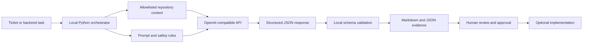
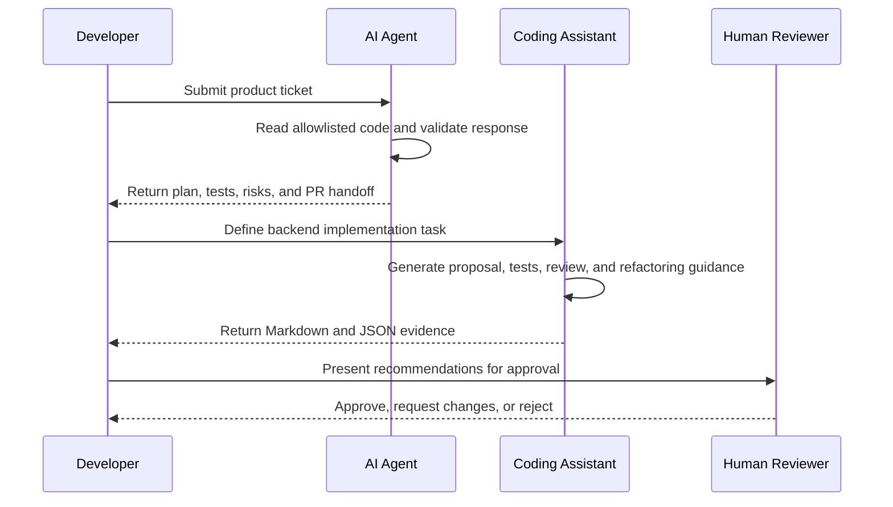

# Submission Upload Note

## Overview

This submission presents a Proof of Concept (PoC): a small working demonstration of artificial intelligence supporting software development in two connected use cases. Both use the same anonymized Express password-reset application.

The attached documents, source files, and Use Case 1 video are the primary submission evidence. The YouTube links and GitHub repository are optional backup access points in case a reviewer has difficulty opening an attachment. The written submission is intended to be understandable without opening an external link.

## Sample Application Context

The sample application is a small, anonymized Node.js and Express password-reset service. It is the codebase that the two AI workflows inspect; it is not the main product being developed and it is not presented as production-ready authentication.

The browser flow is intentionally simple:

1. A user requests `/auth/reset-password/:token` with a reset-token placeholder.
2. Express routes the `GET` request to a controller that serves `resetPassword.html`.
3. The user submits a password to the matching `POST` route.
4. The controller currently returns a simple success message and includes placeholders where real token validation and database persistence would belong.
5. The AI workflows inspect this behavior and produce recommendations rather than changing it.

The sample contains four files in the AI context allowlist:

| File | Role in the sample |
|---|---|
| `server.js` | Starts Express, parses form data, serves the views, and mounts `/auth` routes. |
| `auth/routes.js` | Maps the password-reset GET and POST requests. |
| `auth/authController.js` | Serves the form and handles the submitted password. |
| `views/resetPassword.html` | Provides the browser form used in the demonstration. |

This small scope makes the technical boundary visible. The AI can reason about a real route, controller, and form, while the reviewer can also see exactly what is missing before any production implementation would be safe.

## Technical Architecture

The PoC has four layers:

1. **Input layer:** a ticket JSON file for Use Case 1 or a defined task dictionary for Use Case 2.
2. **Context layer:** each Python program reads only four allowlisted Express files: the server, routes, controller, and reset-form view.
3. **AI and validation layer:** live mode sends a JSON request to the OpenAI-compatible Chat Completions endpoint. The local program parses the response and checks that the expected fields are present before writing evidence.
4. **Evidence layer:** the validated result is written as human-readable Markdown and, for Use Case 2, a structured JSON result. A learner reviews the result before any implementation decision.



The model receives selected text only. It does not receive the API key or the entire workspace, and it cannot execute commands or modify files. Express is the sample repository and optional local browser demo, not part of the AI control layer.

### Word-friendly architecture view

The following equivalent view is included for reviewers whose document viewer does not render Mermaid diagrams:

```text
INPUT
	Ticket JSON or backend task
			 |
			 v
LOCAL ORCHESTRATOR
	Read allowlisted files
	Build prompts and safety rules
	Select deterministic or live mode
			 |
			 v
AI SERVICE (live mode only)
	Receive selected text in a JSON request
	Return structured analysis
			 |
			 v
LOCAL VALIDATION
	Check required fields and evidence counts
			 |
			 v
EVIDENCE
	Markdown report + JSON result where applicable
			 |
			 v
HUMAN REVIEW
	Approve, request clarification, or reject
```

## Technical Scope and Limitations

The implemented PoC demonstrates local orchestration, controlled repository reading, prompt construction, live API communication, structured-response validation, Markdown/JSON evidence generation, and a human approval boundary. It does not demonstrate an autonomous software agent with permission to change or release code.

The following limitations define what the evidence does not prove:

- The Express application is an anonymized sample. It has no real database, password-hashing service, token store, authentication provider, or production error middleware.
- The password-reset controller is illustrative. The generated validation proposal does not by itself prove secure token validation, password persistence, or complete authentication security.
- The repository has no configured unit-test or integration-test runner. Test cases in the reports are proposals and have not been presented as executed test results.
- The local repository reader uses an explicit four-file allowlist. It does not discover every dependency, run the application, run tests, or inspect a production repository.
- Deterministic mode proves local report generation only. Live mode proves that the configured API returned a structured response, not that every recommendation is correct.
- The PoC does not measure production time savings, model cost at scale, response quality across a large ticket set, or deployment readiness.

The sample application's missing services are deliberate scope boundaries, not hidden functionality. They allow the review to focus on AI-assisted planning and coding guidance without using real credentials, customer data, or a production authentication system.

Both use cases produce recommendations. A developer must confirm requirements, implement approved changes, and run appropriate tests.

## Use Case 1: AI Agent for Story-to-PR Readiness

Use Case 1 begins with a product ticket requesting a clearer password-reset confirmation page. The local Python program `agent-demo.py` reads the ticket, adds selected repository context, and sends it to an OpenAI-compatible language-model endpoint in live mode.

The program validates the response and writes a Markdown report containing assumptions, impacted files, an implementation plan, tests, review findings, and a pull-request handoff. It does not edit, merge, deploy, or approve code.

This use case demonstrates how a product-level request can become a traceable, reviewable plan for a developer.

## Use Case 2: AI Coding Assistant

Use Case 2 begins with a backend task: validate the submitted password without exposing credentials. The local Python program `coding-assistant-demo.py` supplies the model with the developer role, task, acceptance criteria, safety rules, and limited Express context.

The evidence includes a controller proposal, valid and invalid test ideas, scaffolding, follow-up explanations, security findings, refactoring guidance, and prompt comparison. It also identifies unresolved token, persistence, error-handling, and test-runner concerns.

This use case demonstrates coding assistance as a reviewable proposal rather than automatic code generation.

## Technical Processing Details

### Sample application request path

The workflows analyze a small Express application. Its browser-facing path is:

| Step | Component | Technical behavior |
|---|---|---|
| 1 | `server.js` | Creates the Express application, parses URL-encoded form data, serves the `views` directory, and mounts the authentication routes at `/auth`. |
| 2 | `routes.js` | Maps `GET /auth/reset-password/:token` to the reset-form controller and `POST /auth/reset-password/:token` to the reset handler. |
| 3 | `resetPassword.html` | Presents the password-reset form to the user. |
| 4 | `authController.js` | Returns the form for the GET request and currently returns a simple success response for the POST request. |
| 5 | AI evidence | Identifies the missing validation, token, persistence, error-handling, and testing concerns without changing these files. |

The visible `:token` parameter helps the review identify that token validation is absent. The sample demonstrates responsible AI review, not complete authentication.

### Use Case 1 request and response

`agent-demo.py` sends the ticket identifier, title, story, acceptance criteria, and selected repository text. Its system instruction requires the model to return JSON fields for the title, story, acceptance criteria, clarification, impacted files, implementation plan, test cases, review findings, and pull-request summary. The local script rejects an incomplete response before it creates the report and controls the output folder using the original ticket ID.

### Use Case 2 request and response

`coding-assistant-demo.py` sends the task, backend role, acceptance criteria, safety rules, selected repository text, and a response contract. Before a live request, secret-like values matching API keys, tokens, or passwords are redacted from the context. The local script checks the required response structure, requires at least three chat answers and three review findings, records the model and provider, and writes both Markdown evidence and `result.json`.

The outputs serve different purposes: `evidence.md` is the human presentation report; `result.json` preserves the structured response and provenance.

### Offline and live modes

| Mode | Processing | Network requirement | Evidence meaning |
|---|---|---|---|
| Deterministic/offline | Uses the local fallback response and writes the same style of evidence. | None. | Confirms that local orchestration and report generation work; it is not proof of a live model call. |
| Live AI | Sends the controlled JSON request to the configured OpenAI-compatible endpoint. | Outbound HTTPS and `OPENAI_API_KEY`. | Records AI-generated provenance, model, and provider endpoint in the evidence. |

### Use-case relationship



## Tools and Technologies

- **Python 3:** runs the two local orchestration programs and writes the evidence.
- **OpenAI-compatible API:** provides live language-model analysis when the live demonstration is run.
- **Node.js and Express:** run the anonymized password-reset sample application.
- **JavaScript:** implements the sample server, routes, and controller.
- **JSON:** stores ticket input and structured assistant output.
- **Markdown:** stores human-readable reports, prompts, reviews, and reflection.
- **PowerShell:** runs commands and keeps the API key in an environment variable.
- **Git and GitHub:** version and share the anonymized project.

The demonstrations can also run in deterministic offline mode. Live mode requires network access to the configured API endpoint; the sample application can run locally at `http://localhost:3000` and does not require public hosting.

## Submission Files and Access

- The Use Case 1 video is included with the submission as an archive. The archive was prepared for the upload system; if the uploaded extension cannot be opened, use the correctly identified RAR version or the optional YouTube backup.
- The Use Case 2 video is available on YouTube because the video exceeds the submission upload limit.
- The required written documents and generated evidence are included with the submission.
- The complete anonymized source repository is available on GitHub for optional inspection.
- An archive of the full repository is also included for offline reference.

The archive and links provide alternative ways to access the same demonstration. They are not separate use cases and do not replace the written evidence.

## File Format and Accessibility

- The primary written documents should be submitted as readable `.docx` files, with their original `.md` versions retained in the repository.
- Tables and headings should remain intact after Word conversion. The text architecture diagram is provided as a fallback if Mermaid diagrams do not render.
- Markdown reports are plain-text evidence and can be opened in VS Code, GitHub, or any text editor.
- `result.json` is structured evidence and can be opened in a text editor or JSON viewer.
- Video files should use their true archive or video extensions. If an archive was compressed as RAR, it should be labelled `.rar`; do not rely on a misleading `.zip` extension.
- The attached files are the primary evidence. YouTube and GitHub are optional backups and should not be required to understand the submission.

## Reviewer Accessibility Checklist

The submission is designed to remain reviewable even if one delivery method fails:

1. Start with the attached Word or Markdown version of `submission-description.md`.
2. Read the attached `submission-overview` and `README` documents for the full evidence map.
3. Open the attached Markdown reports and JSON result files for the generated evidence.
4. If the Use Case 1 archive does not open, verify that its actual format matches its extension and use an archive tool that supports RAR files. The Use Case 1 YouTube link is the backup.
5. Use the Use Case 2 YouTube link when the video exceeds the upload limit.
6. Use GitHub only as an optional source-code mirror; the submission documents and evidence should be sufficient without it.

All important explanations are included in the written documents. External links are supplementary, not required to understand the use cases or evaluate the evidence.

### Optional video links

- Use Case 1: https://www.youtube.com/watch?v=ic6pXUANFSM
- Use Case 2: https://www.youtube.com/watch?v=lrUSriu9urk

### Optional repository links

- Documentation: https://github.com/ebtenorio/MyridiusAiPoC/tree/main/docs
- Complete repository: https://github.com/ebtenorio/MyridiusAiPoC

## Recommended Reading Order

1. `submission-overview.md` for the complete explanation.
2. `README.md` for the document index and file descriptions.
3. The generated Use Case 1 and Use Case 2 evidence reports.
4. The reproduction guides, architecture, tool evidence, review, reflection, and compliance documents.

All recommendations remain subject to human review. The PoC uses anonymized sample code and does not claim to be production-ready authentication software.
