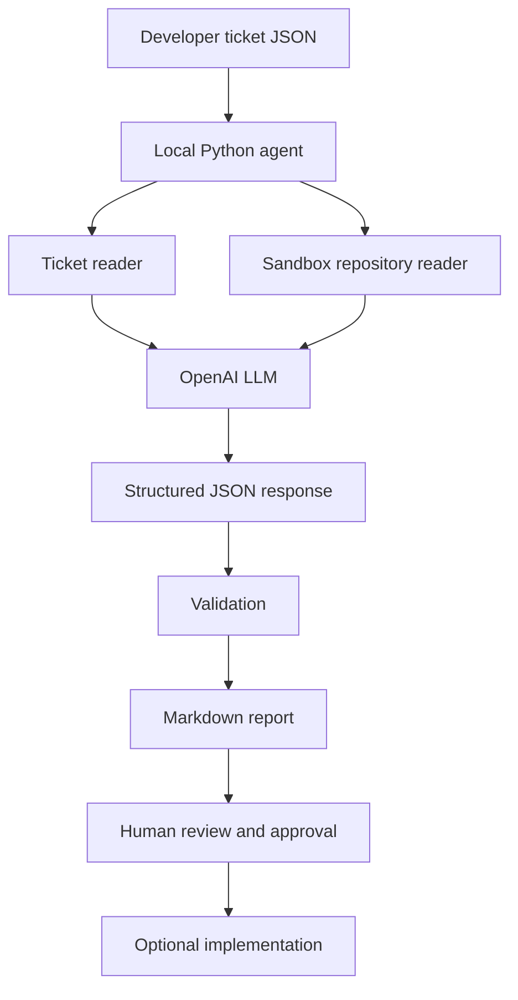

# Use Case 1 Demo Script: AI Agent

## Demo Goal

Demonstrate an AI agent that takes a developer ticket, reads a sandbox repository, sends relevant context to OpenAI, and produces an implementation-ready report for human review.

The agent does not modify application code, merge pull requests, deploy, or approve its own recommendations.

## Tools Needed

### Required

- VS Code: open the repository and present the files and generated reports.
- Git and GitHub: retrieve and share the sandbox repository.
- Python: run the local agent script.
- OpenAI API account and credits: provide access to the live LLM.
- OpenAI API key: authenticate the request through `OPENAI_API_KEY`.
- PowerShell or another terminal: run the commands.
- Node.js and npm: run the sample Express repository if demonstrating the application.
- Internet connection: reach the OpenAI API and GitHub.

### Project components

- [agent-demo.py](../agent-demo.py): local AI-agent orchestrator.
- [tickets/new-ticket.json](../tickets/new-ticket.json): developer ticket input.
- [myridius-auth-demo](../myridius-auth-demo): sandbox repository analyzed by the agent.
- [markdown_docs](../markdown_docs): generated reports.
- [docs/architecture-diagram.md](architecture-diagram.md): workflow architecture.
- [docs/prompt-pack.md](prompt-pack.md): prompts and response contract.

## Presenter Setup

Before the demo, confirm that:

1. The repository is open in VS Code.
2. The ticket contains only sample or anonymized information.
3. No API key is stored in the repository.
4. The OpenAI key is available in the current terminal session.
5. The model is selected for the demo.

Use PowerShell:

```powershell
$env:OPENAI_API_KEY = "your-api-key"
$env:OPENAI_MODEL = "gpt-4o-mini"
```

Verify the key without displaying it:

```powershell
if ($env:OPENAI_API_KEY) {
    Write-Host "OPENAI_API_KEY is configured"
} else {
    Write-Host "OPENAI_API_KEY is missing"
}
```

Never show the key on screen or include it in the presentation.

## Opening Statement

Say:

> This proof of concept demonstrates a story-to-PR-readiness AI agent. A developer provides a ticket and acceptance criteria. The local agent reads the relevant sandbox repository files, sends controlled context to an OpenAI model, validates the structured response, and saves a report. The developer remains in control of every implementation decision.

## Part 1: Show the Ticket

Open [tickets/new-ticket.json](../tickets/new-ticket.json) and say:

> This JSON file represents the developer's intake. It includes a ticket ID, title, story, and acceptance criteria. The ticket concerns replacing the password-reset success message with a confirmation page.

Point out that the ticket ID controls the local report folder:

```json
"id": "ticket-6"
```

Explain:

> In AI mode, the agent sends the intake fields to OpenAI. Any old planning or review fields in the JSON are ignored so the model must independently produce the analysis.

## Part 2: Explain the AI Agent

Open [agent-demo.py](../agent-demo.py) and explain:

> The AI agent is this local Python program. It is not uploaded as a file to OpenAI. It is an application that orchestrates the interaction with the model.

Describe its responsibilities:

1. Load the ticket JSON.
2. Read selected repository files.
3. Build the system and user prompts.
4. Call the OpenAI chat completions endpoint.
5. Require a structured JSON response.
6. Preserve the local ticket ID.
7. Write the Markdown report.

The model performs the analysis, while the local program controls the tools, data boundary, validation, and output path.

## Part 3: Show Repository Context

Open these sandbox files:

- [myridius-auth-demo/server.js](../myridius-auth-demo/server.js)
- [myridius-auth-demo/auth/routes.js](../myridius-auth-demo/auth/routes.js)
- [myridius-auth-demo/auth/authController.js](../myridius-auth-demo/auth/authController.js)
- [myridius-auth-demo/views/resetPassword.html](../myridius-auth-demo/views/resetPassword.html)

Say:

> The repository reader gives the model real context. It can see how the Express server registers routes, how the reset route maps to the controller, how the controller currently returns a success string, and how the reset form is presented. This is what makes the output repository-aware rather than generic.

## Part 4: Explain the OpenAI Connection

Show the environment variables and explain:

> The API key is passed through the terminal environment and placed in the HTTP authorization header by the local script. It is not included in the ticket, prompt text, report, or Git repository.

The request contains:

- The selected model, such as `gpt-4o-mini`.
- A system prompt defining the developer-agent role.
- The ticket intake fields.
- The selected repository file contents.
- A request for JSON output.

The system prompt asks OpenAI to return:

- Clarification
- Impacted files
- Implementation plan
- Test cases
- Review findings
- PR summary

It also tells the model not to edit files, execute commands, expose secrets, merge, deploy, or approve changes.

## Part 5: Run the Live Demo

From the repository root, run:

```powershell
python agent-demo.py --ai tickets/new-ticket.json
```

If needed, use the configured Python interpreter directly:

```powershell
C:/Users/ebten/AppData/Local/Python/pythoncore-3.14-64/python.exe agent-demo.py --ai tickets/new-ticket.json
```

Expected terminal output:

```text
Generated 1 demo reports in C:\MyridiusAiPoC\MyridiusAiPoC\markdown_docs
```

Say:

> The API response has now been received, parsed as JSON, checked for all required fields, and passed to the local report writer. The agent does not store the raw API response or the API key.

## Part 6: Show the Result

Open [markdown_docs/ticket-6/report.md](../markdown_docs/ticket-6/report.md).

Walk through the sections:

- `Analysis mode: AI-generated`: confirms the live AI path was used.
- `Story`: preserves the original ticket intent.
- `Acceptance Criteria`: preserves the expected behavior.
- `Clarification`: identifies missing information or assumptions.
- `Impacted Files`: identifies likely files affected by the ticket.
- `Implementation Plan`: proposes implementation steps.
- `Test Cases`: proposes unit, integration, security, and regression checks.
- `Review Findings`: identifies risks or states when no findings were returned.
- `PR Summary`: creates a handoff for a human reviewer.
- `Repository Evidence`: shows the local file context used by the workflow.

Say:

> This report is not an automatic code change. It is a traceable handoff from the story to likely files, implementation tasks, tests, review risks, and next steps.

## Part 7: Demonstrate Human Approval

Pause at the report and say:

> This is the approval point. The learner reviews whether the impacted files are correct, whether the plan is safe, whether the tests are sufficient, and whether security concerns are addressed. Only after approval would a developer implement the change.

Emphasize that the current agent cannot:

- Modify application files
- Auto-merge a pull request
- Auto-deploy
- Bypass review
- Approve its own recommendation

## Optional: Show the Deterministic Fallback

Run:

```powershell
python agent-demo.py tickets/new-ticket.json
```

Explain:

> Deterministic mode validates the local ticket and report-generation workflow without calling OpenAI. AI mode is the live LLM demonstration.

## Architecture Summary



## Closing Statement

Say:

> This PoC demonstrates how an AI agent can reduce the manual effort involved in moving from a ticket to PR readiness. The value comes from combining an LLM with repository tools, structured prompts, response validation, persistent Markdown evidence, and a human approval gate. It accelerates analysis without giving the agent authority to change or release software.

## Expected Success Criteria

The demo is successful when the audience can see that:

- A real ticket is accepted.
- The sandbox repository is inspected.
- A live OpenAI model is called.
- A structured AI response is validated.
- A report is generated and stored locally.
- The report includes implementation guidance, tests, review findings, and a PR summary.
- Human approval remains mandatory.

## Troubleshooting Talking Points

### `OPENAI_API_KEY` is missing

Set it in the current PowerShell session and retry.

### `credit_balance_exhausted`

The OpenAI account or project needs API credits. This is a billing issue, not a ticket-processing issue.

### `HTTP 429`

Check whether the message indicates exhausted credits or a rate limit. Do not repeatedly retry an exhausted account.

### `KeyError: 'id'`

The local agent preserves the ticket ID even if the model omits it. Rerun the updated script.

### The report looks unchanged

Confirm that the command includes `--ai`, then reopen the report generated for the current ticket ID. Check for:

```markdown
**Analysis mode:** AI-generated
```
